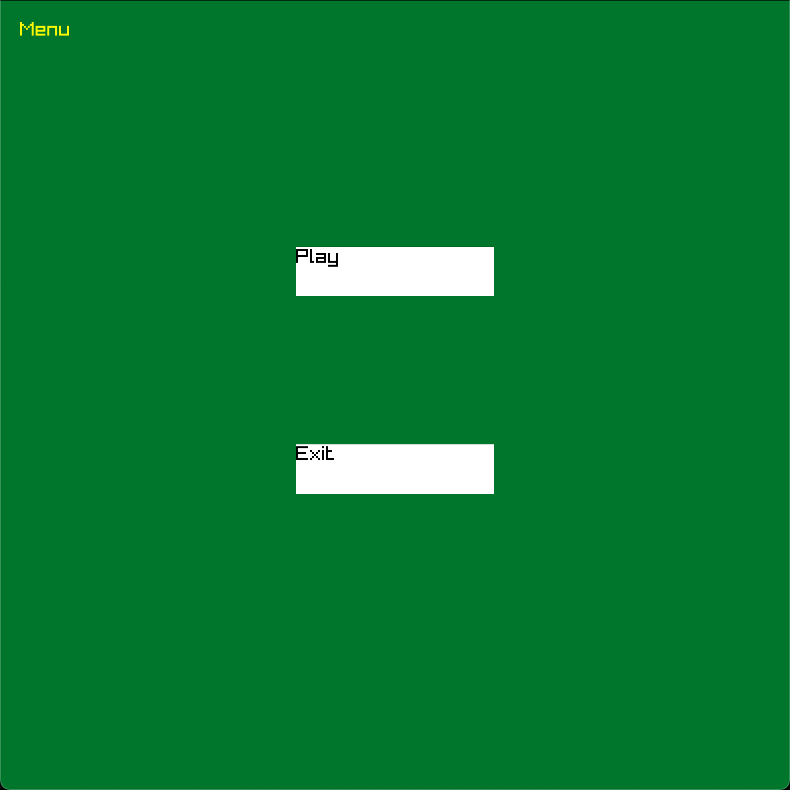
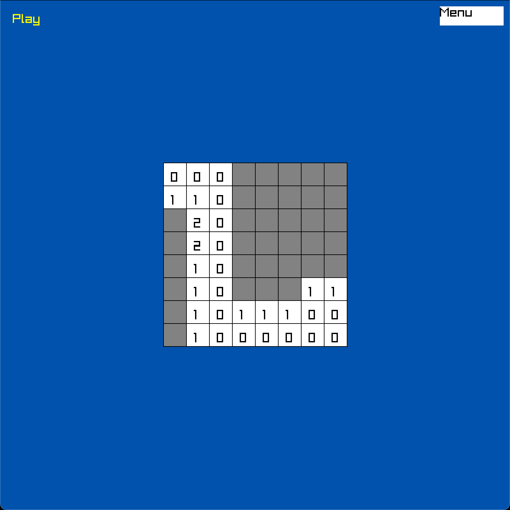

# DungeonSweeper
This is a very simple Minesweeper clone for testing WebAssembely with Raylib

* [Features](#features)
* [Notes](#notes)
* [Building](#building)
* [Media](#media)
* [License](#license)

## Features
* Play a simple MineSweeper like game in your browser or any operatingsystem.
* Repeatable game loop with button controls.
* Scene management with menu, play and victory scene.
* Drawing to rendertextures for debug, game and gui.

## Notes
* Click to uncover a tile and reveal if it is a mine.
* This project was my first Webassembly game and I have also used it to text on different plattforms (macos, linux, windows, web)
* I will use the implemented systems in my next projects

## Building

### Prerequisites
* **CMake** (3.15 or newer)
* **C++ Compiler** (e.g.,GCC, Clang, MSVC)
* **Git** (for fetching dependencies)
* **Emscripten SDK** (only for web builds)
* **Python 3.8+** (only for web builds)

### Desktop Build (Windows, macOS, Linux)
1. **Configure and build with CMake:**
    ```bash
    mkdir build
    cd build
    cmake ..
    cmake --build .
    ```
    The example binaries will be located in the `build/bin` directory.

### Web Build (WebAssembly)
1.  **Configure and build with Emscripten**
    ```bash
    cd tools
    ./build_web.sh
    ```
    Now there should be a HTTP Server running under port 8000 to test your project. The URL should be visible in the active terminal.

## Media
### Menu Scene:


### Play scene:


## License
This project is licensed under the MIT License - see the [LICENSE](LICENSE) file for details.
